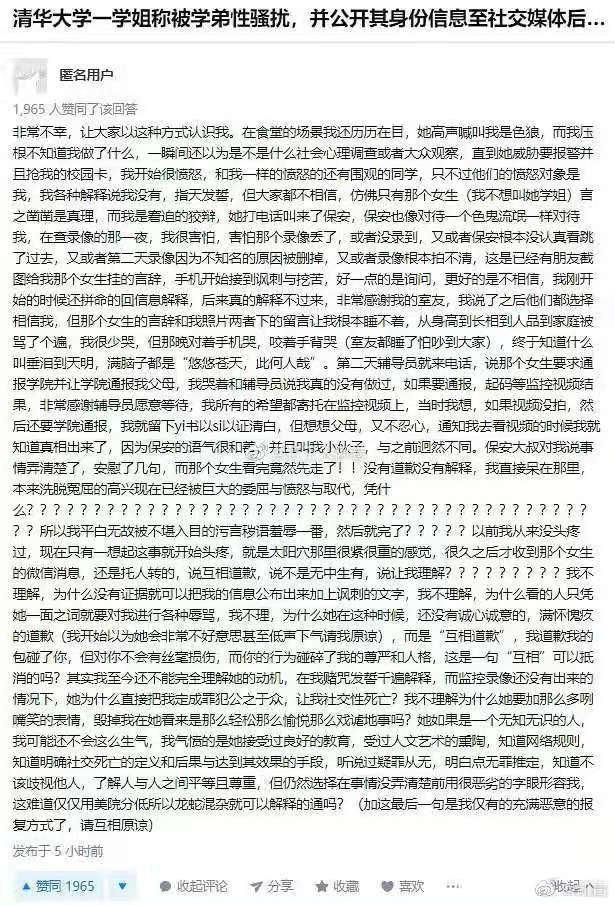
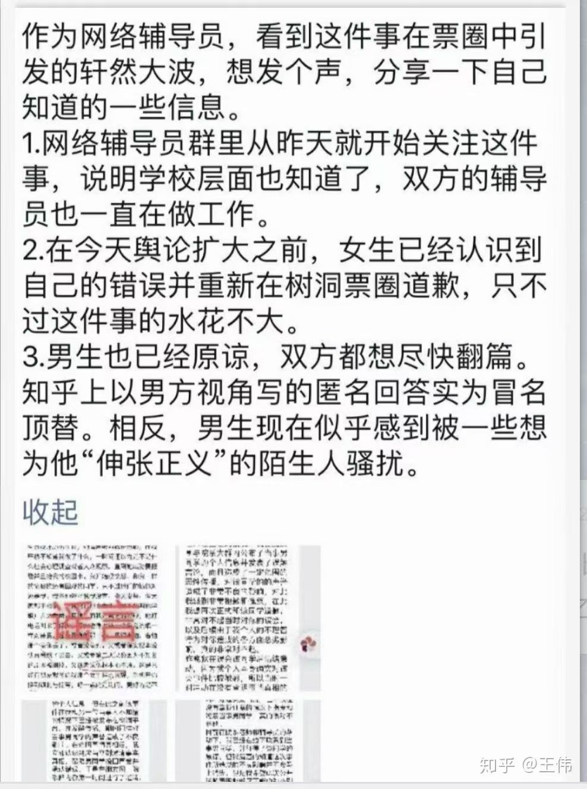

# MiniMovie
美院学姐事件微电影

组织一下同学来拍一部微电影，紧跟时事，就是从没让学姐认为自己被摸屁股到去查监控，发现不是，到现在的网络暴力以及知乎上面假学弟发表的一系列言论，引发更进一层的，针对学姐的网络暴力。特别突出在这件事情中被裹挟的，围观的或者发表各种言论的群众，可以以戴着面具的形式来拍。

甚至可以做成大数据艺术，以清华树洞17日至今的讨论做。

类似于Refik Anadol的作品 [How This Guy Uses A.I. to Create Art](https://youtu.be/I-EIVlHvHRM)

## 目的

提醒大家：

互联网有记忆

匿名会暴露一部分人的丑恶

无脑喷子有不少，虽然不是多数

选择性相信

网络暴力参与者应负责任，每个参与的人都有责任

为何会身份对立，院系对立，性别对立。希望的平等

被误导并参与到事件中来的群众

那些人不应忘记这件事，每个参与到网络暴力的人都是输了的一方，网络世界的记忆太短暂了

## 一些想法

认知水平和逻辑思维的区别，真的会导致这种事情的发生，这种在我看起来都已经超出常理的事情。现在想起来真的这几天好魔幻现实

## 素材

来源：清华树洞，知乎，微博

