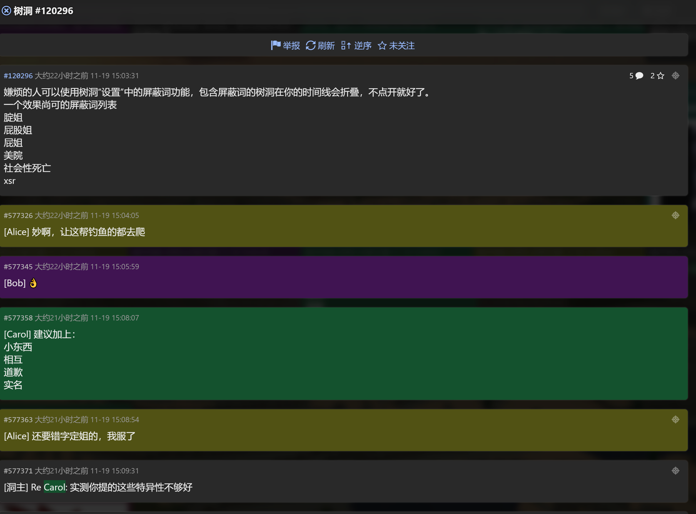
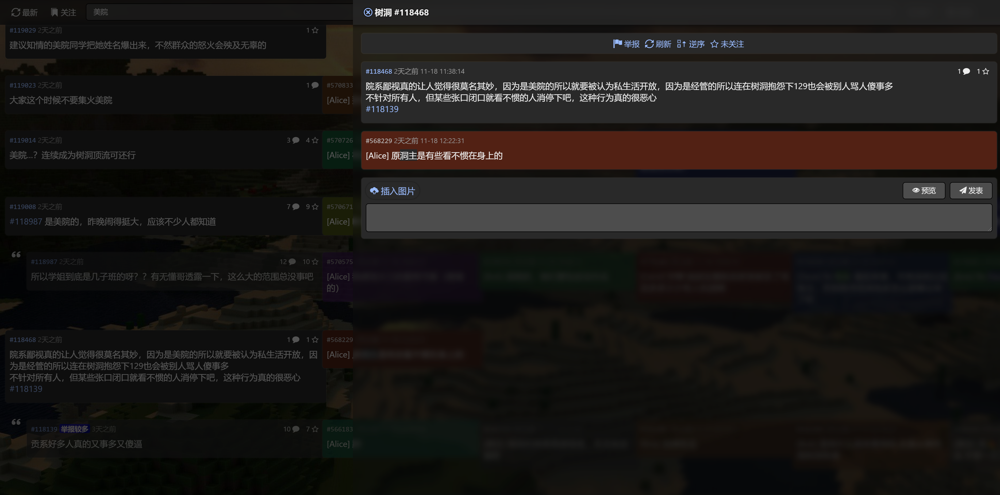
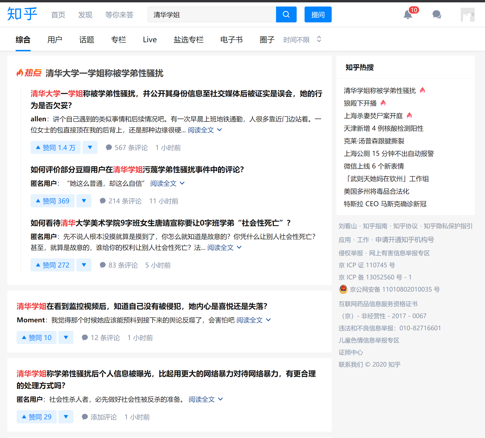
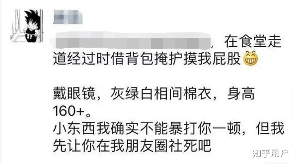
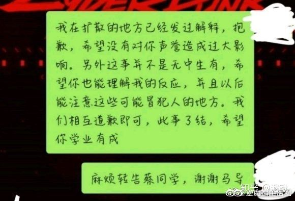
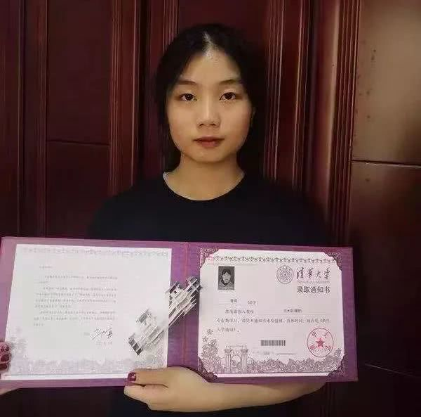
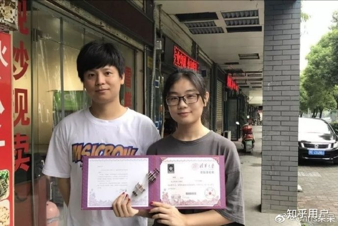
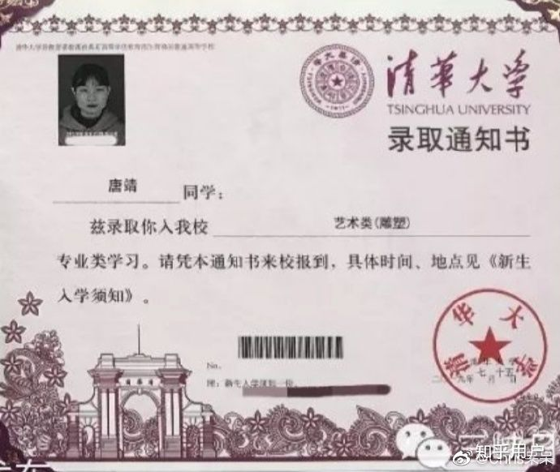
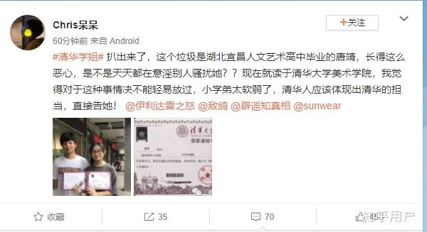

# MiniMovie
美院学姐事件微电影

组织一下同学来拍一部微电影，紧跟时事，就是从没让学姐认为自己被摸屁股到去查监控，发现不是，到现在的网络暴力以及知乎上面假学弟发表的一系列言论，引发更进一层的，针对学姐的网络暴力。特别突出在这件事情中被裹挟的，围观的或者发表各种言论的群众，可以以戴着面具的形式来拍。

甚至可以做成大数据艺术，以清华树洞17日至今的讨论做。

类似于Refik Anadol的作品 [How This Guy Uses A.I. to Create Art](https://youtu.be/I-EIVlHvHRM)

## 目的

提醒大家：

互联网有记忆

匿名会暴露一部分人的丑恶

无脑喷子有不少，虽然不是多数

选择性相信

网络暴力参与者应负责任，每个参与的人都有责任

为何会身份对立，院系对立，性别对立。希望的平等

被误导并参与到事件中来的群众

那些人不应忘记这件事，每个参与到网络暴力的人都是输了的一方，网络世界的记忆太短暂了

## 一些想法

认知水平和逻辑思维的区别，真的会导致这种事情的发生，这种在我看起来都已经超出常理的事情。现在想起来真的这几天好魔幻现实

## 爬取清华树洞讨论

可以使用如下关键词检索，或者爬取所有自20201117以来的洞，估测从#118000开始。

## 素材

来源：清华树洞，知乎，微博

## 刑事责任认定

https://www.zhihu.com/question/431088815

https://www.guancha.cn/FaZhi/2017_06_01_411060.shtml

http://www.court.gov.cn/zixun-xiangqing-43932.html

《最高人民法院、最高人民检察院关于办理侵犯公民个人信息刑事案件适用法律若干问题的解释》第三条对非法“提供公民个人信息”的认定作了进一步明确。具体而言：一是“提供”的认定。在“人肉搜索”案件中，行为人未经权利人同意即将其身份、照片、姓名、生活细节等个人信息公布于众，影响其正常的工作、生活秩序，危害严重。基于此，《解释》规定：“向特定人提供公民个人信息，以及通过信息网络或者其他途径发布公民个人信息的，应当认定为刑法第二百五十三条之一规定的‘提供公民个人信息’。

影响其正常的工作、生活秩序，危害严重。情节严重的，处三年以下有期徒刑或者拘役。

知乎热榜和微博热榜

原帖备份（仅诉诸法律用，勿传播）：

https://www.zhihu.com/question/431088815

如何看待清华大学美术学院9字班女生唐靖宣称要让0字班学弟“社会性死亡”？

唐靖的朋友圈状态：她的相关信息如下：
[宜昌首份大学录取通知书送达，来自清华！快看看是谁家的孩子-看点快报​kuaibao.qq.com](https://link.zhihu.com/?target=https%3A//kuaibao.qq.com/s/20190724A061G100%3Frefer%3Dspider)

